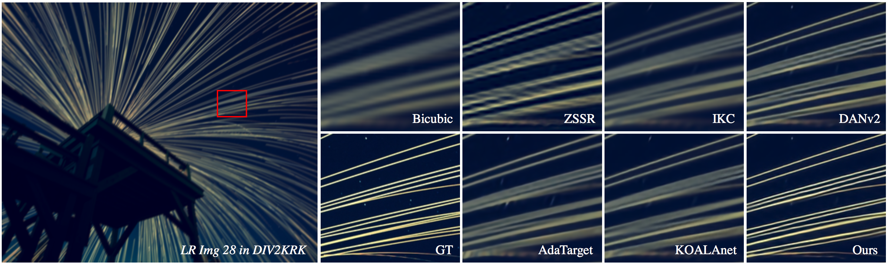
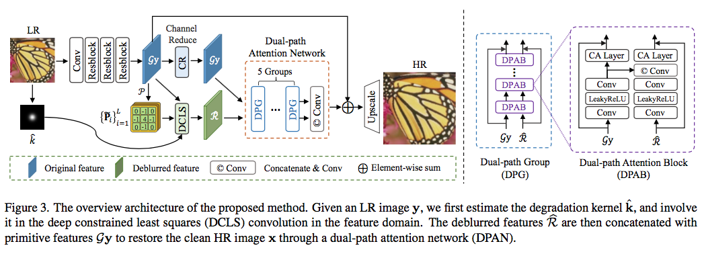
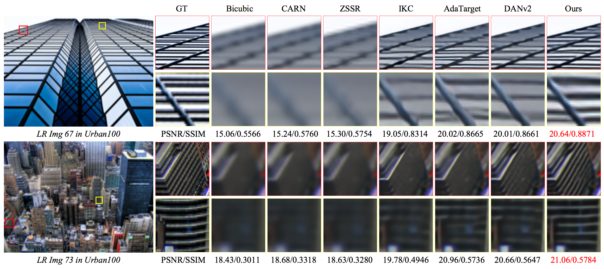
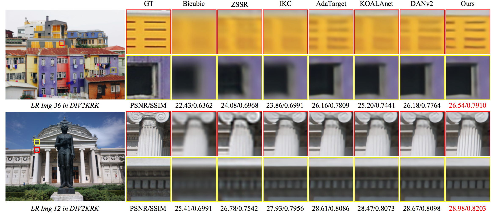

## Deep Constrained Least Squares for Blind Image Super-Resolution


'Deep Constrained Least Squares for Blind Image Super-Resolution', CVPR 2022 | [[Paper](https://arxiv.org/pdf/2202.07508)].


### Updates
[**2022.04.22**] 🎉🎉🎉 We won the 1st place in NTIRE 2022 BurstSR Challenge again [[Paper]](https://arxiv.org/abs/2204.08332)[[Code]](https://github.com/Algolzw/BSRT).    
[**2022.03.15**] **Note!!! We will not maintain this repository after April. All codes and models will move to [here](https://github.com/megvii-research/DCLS-SR).**  
[**2022.03.09**] We released the code and provided the pretrained model weights [here](https://drive.google.com/drive/folders/135xCCLWSylBaNxh6B3I_UnCeox8AkVzC?usp=sharing).  
[**2022.03.02**] Our paper has been accepted by CVPR 2022.




## Overview




## Results

#### Comparison on Isotropic Gaussian kernels (Gaussian8)


#### Comparison on Anisotropic Gaussian kernels (DIV2KRK)



## Citations
If our code helps your research or work, please consider citing our paper.
The following is a BibTeX reference.

```
@inproceedings{luo2022deep,
  title={Deep constrained least squares for blind image super-resolution},
  author={Luo, Ziwei and Huang, Haibin and Yu, Lei and Li, Youwei and Fan, Haoqiang and Liu, Shuaicheng},
  booktitle={Proceedings of the IEEE/CVF Conference on Computer Vision and Pattern Recognition},
  pages={17642--17652},
  year={2022}
}
```

## Contact
email: [ziwei.ro@gmail.com]
